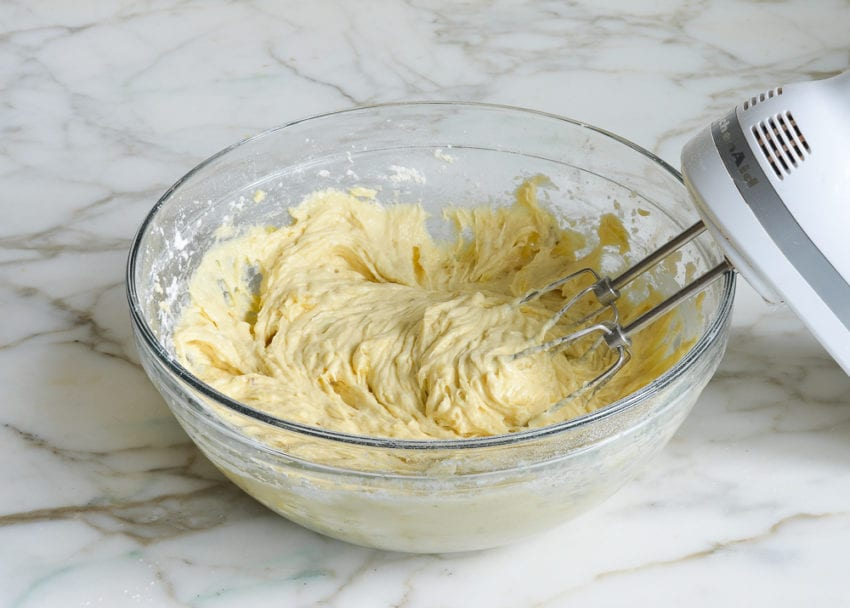
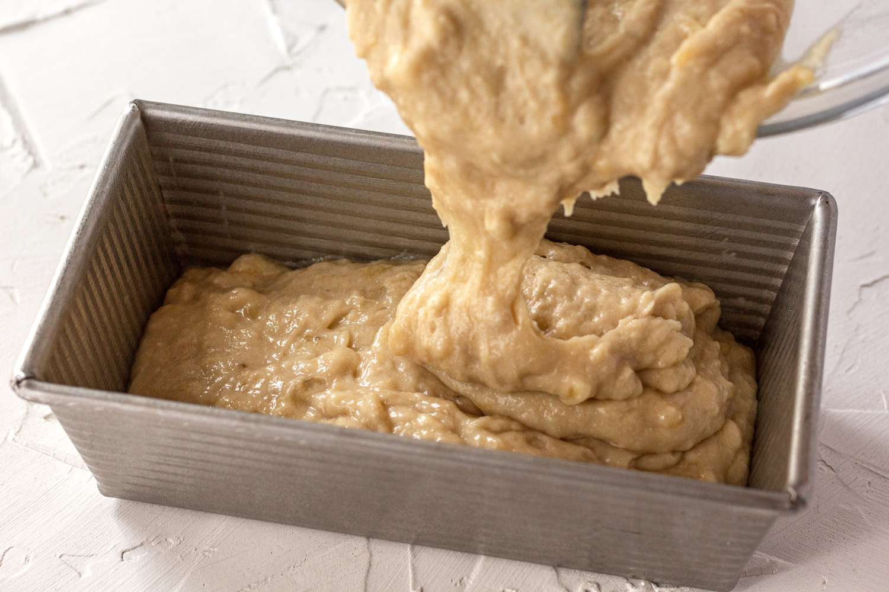

# How to Bake Banana Bread
This recipe will leave you with a loaf of bread that will impress even the pickiest of eaters
## Needed Ingredients
- 1 1/4 cups sugar
- 1/2 cup butter, softened
- 2 eggs
- 1 1/2 cups mashed very ripe bananas (3 to 4 medium)
- 1/2 cup buttermilk
- 1 teaspoon vanilla
- 2 1/2 cups Gold Medal™ All-Purpose Flour
- 1 teaspoon baking soda
- 1 teaspoon salt
- 1 cup chopped nuts, if desired
- RECOMMENDED: Hand mixer
## Steps
1. Heat oven to 350*F
2. Grab a loaf pan that is 9x5x3 inches
3. In a large bowl, mix sugar, butter, and eggs
> 
> Make sure it is well blended!
4. Add bananas, buttermilk, and vanilla and then mix with the hand mixer
> 
> 
> This should be very thoughly mixed, there should be as few chunks of banana as possible
5. Stir in flour, baking soda, and salt until moistened
> This should be mixed only until all of the dry ingredients are mixed in
> Mix as little as possible
6. Add nuts if desired
> Be careful if anybody is allergic to them!
7. Pour mixture into pan
> 
> Make sure the batter is pretty level, you can pick up the pan and tap it on the counter a few times to help
8. Bake the bread for about 1 hour and 15 minutes or until toothpick inserted in the center comes out clean
> The bread should be a toasty golden brown color, there should not be any raw mix on the toothpick when you pull it out
9. Let cool for two hours
> This helps the bread to set so that it won't crumble apart when you first cut it
10. Serve your bread!
> 
